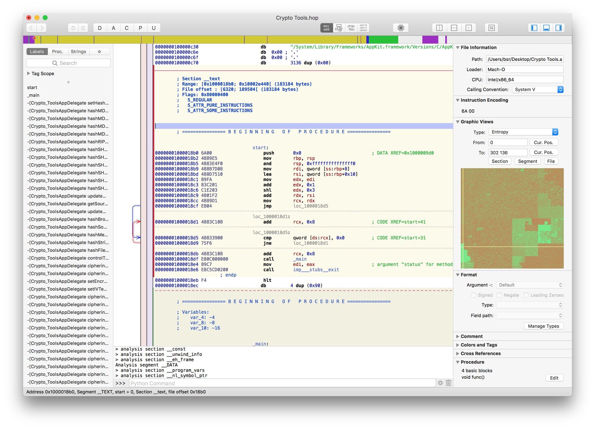
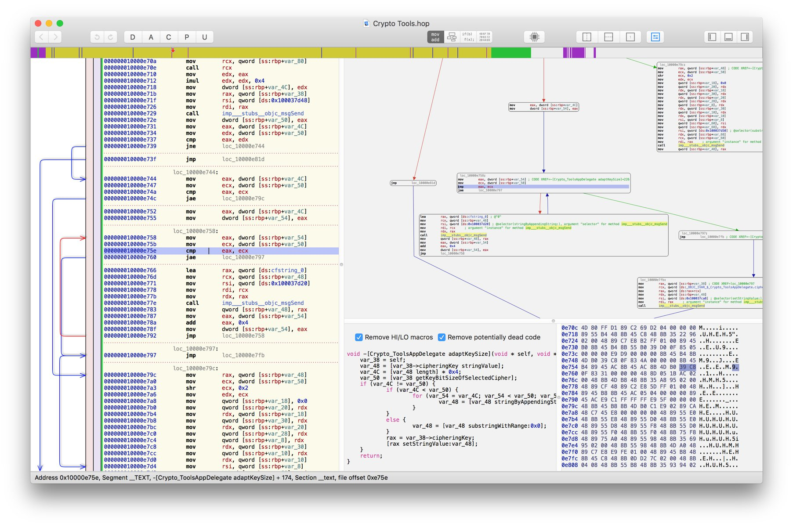
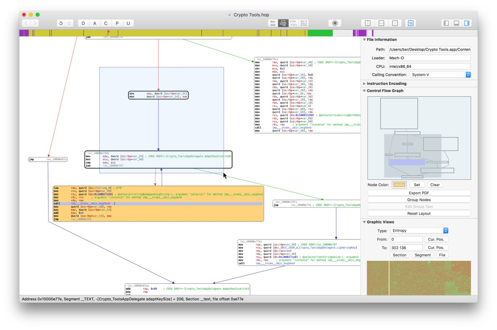
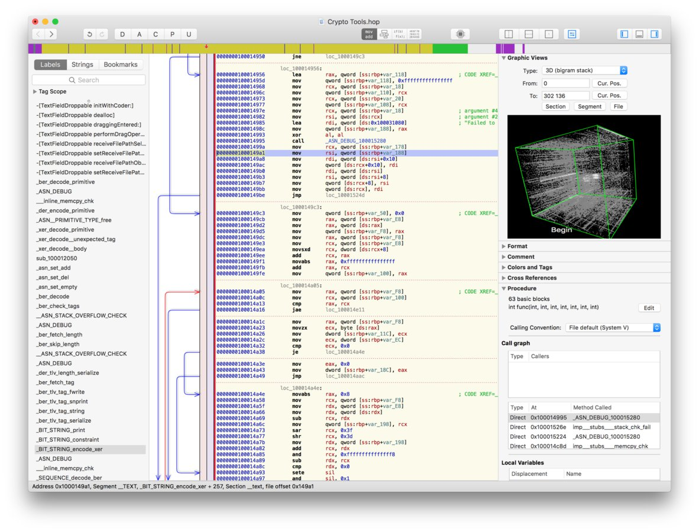

# Hopper

* `Hopper Disassembler`
  * 常简称：`Hopper`
    * 偶尔缩写为：`hd`
  * 是什么：Hopper is a reverse engineering tool for OS X and Linux
  * 一句话描述：
    * the reverse engineering tool that lets you disassemble, decompile and debug your applications
  * 功能：disassemble and decompile
  * 支持平台、架构：32/64bits Intel Mac, Linux, Windows and iOS executables
  * 详解
    * This tool will let you disassemble any binary you want, and provide you all the information about its content, like imported symbols, or the control flow graph! Hopper can retrieve procedural information about the disassembled code like the stack variables, and lets you name all the objects you want.
  * 主要用于：二进制的静态分析
  * 官网
    * https://www.hopperapp.com
  * 截图
    * 
    * 
    * 
    * 

## Hooper导出伪代码

[poboke/Class-Decompile: Class Decompile is a python script for Hopper Disassembler. This script can export pseudo code of the classes. (github.com)](https://github.com/poboke/Class-Decompile)

据说可以导出Hopper的全部伪代码。有空去试试。

注：Hooper本身，想要打开二进制的话，如果二进制太大，比如：

* YouTube的`Module_Framework`
* Aweme的`AwemeCore`

经常直接卡死，无法正常打开

-》导致估计导出全部伪代码，也很困难。

-》想要尝试的话，估计也要找个小一点的二进制去测试。
