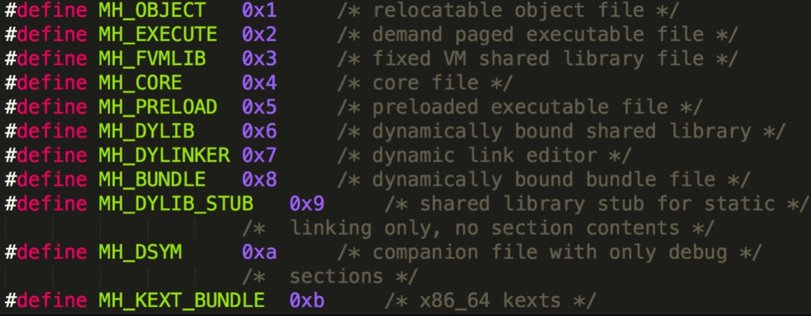
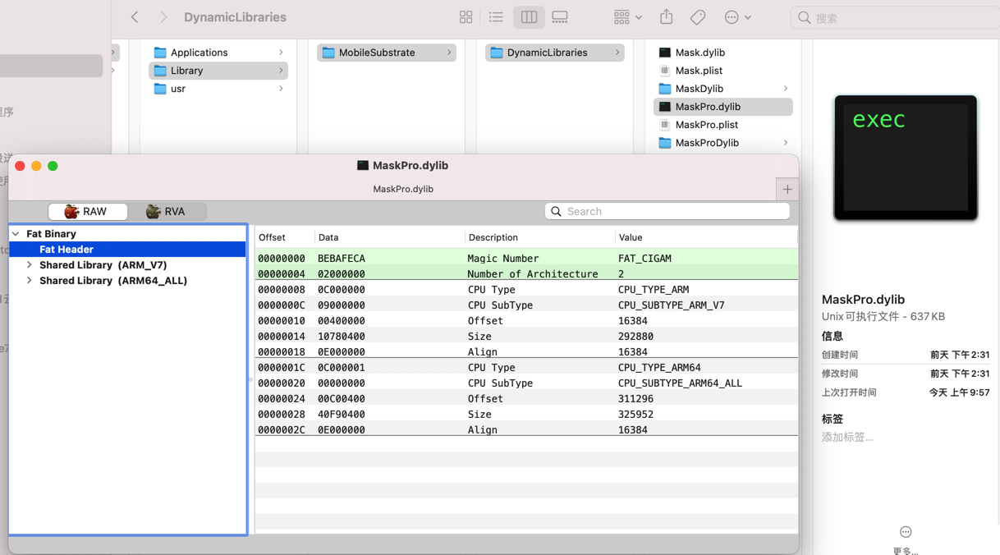
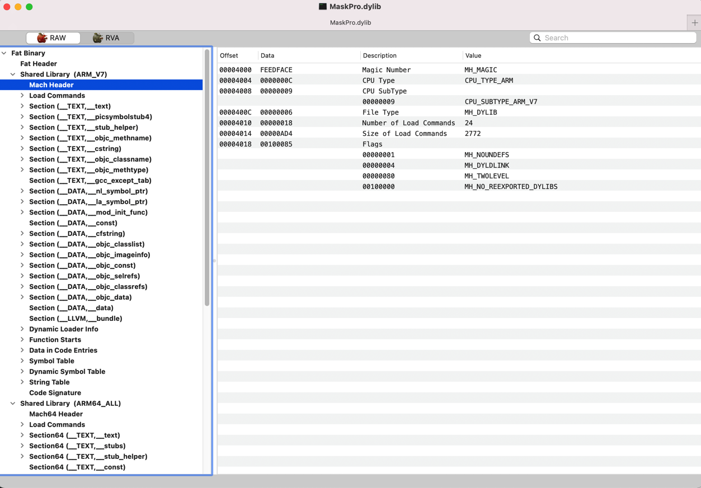
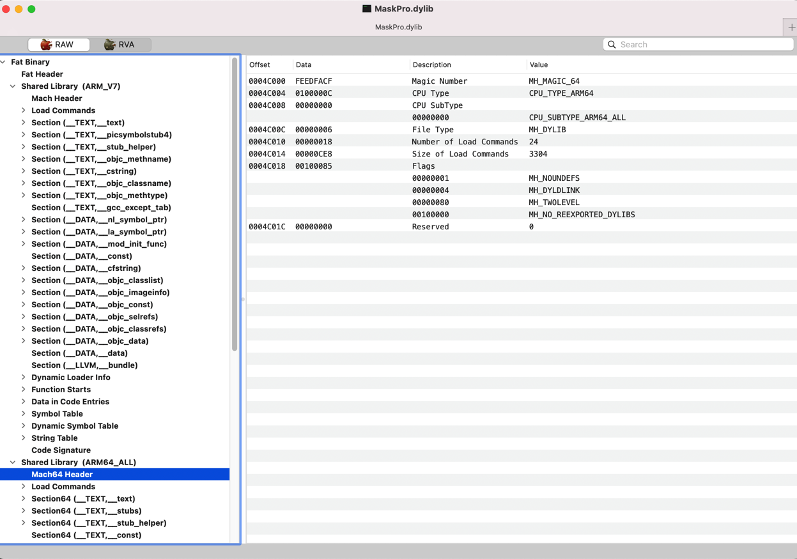

# Mach-O

TODO：

【记录】静态分析Mask的动态库：MaskPro.dylib

---

* `Mach-O`
  * 名称来源：`Mach Object`的缩写
  * 是什么：`Apple`的`Mac`、`iOS`等平台的二进制程序、库等`可执行文件`的底层文件数据格式
  * 常见文件类型
    * 图
      * 
    * 文字
      * `MH_EXECUTE`=可执行文件=`executable`=应用
        * 文件：`.app/xxx`
      * `MH_OBJECT`
        * 目标文件
          * 文件：`.o`
        * 静态库文件=静态链接库=`static library`：N个`.o`合并在一起
          * 文件：`.a`
      * `MH_DYLIB`=动态链接库=`dylib library`：类似于Win中的`DLL`
        * 文件：`.dylib`、`.framework/xxx`
      * `MH_DYLINKER`：动态链接编辑器
        * 文件：`/usr/lib/dyld`
      * `MH_DSYM`：存储着二进制文件符号信息的文件
        * 文件：`.dSYM/Contents/Resources/DWARF/xxx`
          * 常用于分析APP的崩溃信息
  * 基本结构
    * `Header`：文件类型、目标架构类型等
    * `Load commands`：描述文件在虚拟内存中的逻辑结构、布局
    * `Raw segment data`：在Load commands中定义的Segment的原始数据
  * 详细定义
    * 详见：xnu源码
      * https://opensource.apple.com/tarballs/xnu/
        * `EXTERNAL_HEADERS/mach-o/fat.h`
        * `EXTERNAL_HEADERS/mach-o/loader.h`
  * 相关工具：查看和处理Mach-O格式的文件
    * 查看信息
      * `file`：查看Mach-O的文件类型
        * `file inputMacOFile`
      * `MachOView`
      * `jtool2` / `jtool`
      * `otool`：查看Mach-O特定部分和段的内容
      * `lipo`：常用于多架构Mach-O文件的处理
        * 查看架构信息：`lipo -info inputMacOFile`
        * 导出某种特定架构：`lipo inputMachOFile -thin ArchType -output OutputFile`
        * 合并多种架构：`lipo inputMachOFile1 inputMachOFile2 -output OutputFile`
      * `rabin2`
    * 逆向处理
      * 导出头文件
        * `class-dump`

## `FAT Binary`=`胖二进制`

* `Fat Binary`=`胖二进制`=`Fat File`=`胖二进制文件`=`Universal Binary`=`通用二进制文件`
  * 把多个架构的二进制（比如`armv7`、`arm64`等）合并在一起，成了个胖子，所以叫`Fat Binary`
    * 一个由**不同的编译架构**后的`Mach-O`产物所合成的集合体
    * 一个架构的`Mach-O`只能在相同架构的机器或者模拟器上用
    * 为了支持不同架构需要一个集合体
  * 文件大小
    * 一般比单一架构的文件要大
    * 但是由于多架构会共用一部分资源，所以往往比多个（常常是2个）的总大小要小

### 胖二进制的实例

折腾Mask的dylib期间就遇到了`FAT Binary`：

```bash
➜  DynamicLibraries jtool2 -h MaskPro.dylib > MaskProDylib/MaskProDylib_jtool2_h_header.txt
Fat binary, little-endian, 2 architectures: armv7, arm64
Select an architecture setting the ARCH= environment variable
```

即，一个Dylib中，包含了多种架构，此处是`armv7`和`arm64`

此处要指定具体架构，才能继续用`jtool2`查看信息：

```bash
➜  DynamicLibraries export ARCH=arm64
➜  DynamicLibraries jtool2 -h MaskPro.dylib > MaskProDylib/MaskProDylib_jtool2_h_header.txt
```

类似的，后续去用`MachOView`查看信息，也能看到是：`FAT Binary`

* 
  * ARMV7
    * 
  * ARM64
    * 
