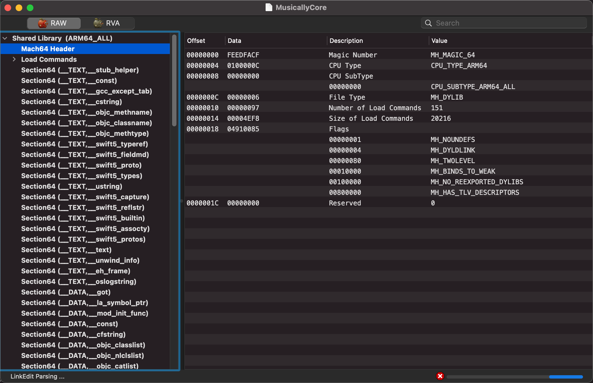
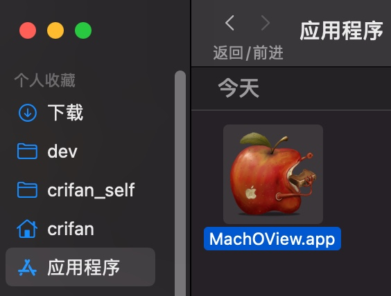

# MachOView

* `MachOView`
  * 是什么：查看和编辑Intel的`x86`和`ARM`的`Mach-O`二进制文件的工具
  * 用途：常用来查看iOS的app的二进制文件的信息
  * 截图
    * 
  * 资料
    * 最早好像是在sourceforge
      * MachOView download | SourceForge.net
        * https://sourceforge.net/projects/machoview/
    * 后来有人fork到GitHub
      * gdbinit/MachOView: MachOView fork
        * https://github.com/gdbinit/MachOView
    * 现在有国人fork后继续维护
      * fangshufeng/MachOView: 分析Macho必备工具
        * https://github.com/fangshufeng/MachOView

## 下载和安装MachOView

* 下载

从[fangshufeng/MachOView: 分析Macho必备工具](https://github.com/fangshufeng/MachOView)，进入此时最新版[Release 2.6.1](https://github.com/fangshufeng/MachOView/releases/tag/2.6.1)去下载

[MachOView-2.6.1.dmg](https://github.com/fangshufeng/MachOView/releases/download/2.6.1/MachOView-2.6.1.dmg)

* 安装

下载后，双击`dmg`，打开窗口，把其中的`MachOView.app`拷贝到`应用程序`即可：

## 一些心得

* 如果二进制太大，或者本身防护做的比较好，则：MachOView完全加载出来二进制信息
  * 往往耗时很久
  * 也往往会直接崩溃，无法继续使用
    * 比如抖音的二进制加载到最后，就被崩溃。
      * 只能在崩溃之前，及时查看（大）部分已解析出的信息
