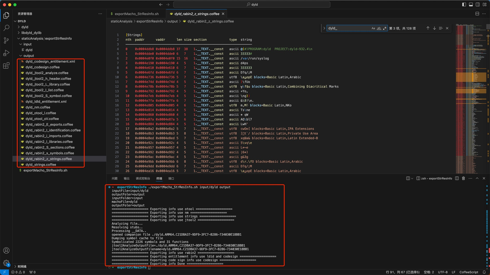

# 通用成套做法

* 典型的**成套的做法** = `nm`+`strings`+`otool`+`jtool2`+`rabin2`+`ldid2`/`codesign`

## 自动处理

用下面的自动化脚本，一键自动处理：

* `exportMacho_StrResInfo.sh`

```sh
#!/bin/bash
# Function: Export/Extract single Mach-O file string and resources related info
# Author: Crifan Li
# Update: 20241015
# Refer: 
#  /Users/crifan/dev/dev_root/androidReverse/CloudPhone/Douyin/dy297/soLibs/common/exportElf_StrResInfo.sh
#  https://book.crifan.org/books/ios_re_static_analysis/website/analysis_examples/bin_info_exp_str.html
# Usage:
#   chmod +x exportMacho_StrResInfo.sh
#   ./exportMacho_StrResInfo.sh input/dyld output

# SEPERATOR="--------------------"
SEPERATOR="===================="

# outpuFileSuffix="txt"
outpuFileSuffix="coffee"

function log() {
  echo "${SEPERATOR} $1 ${SEPERATOR}"
}

function extractInputFolder(){
  curInputFile=$1
  # echo "curInputFile=${curInputFile}"
  retInputFolder="$(dirname "${curInputFile}")"
  # echo "retInputFolder=${retInputFolder}"
  # return retInputFolder
  # return $retInputFolder
  # echo ${retInputFolder}
  echo $retInputFolder
}

function extractFilenameNoSuffix(){
  curInputFile=$1
  # echo "curInputFile=${curInputFile}"
  filenameWithSuffix="$(basename "${inputFile}")"
  # echo "filenameWithSuffix=${filenameWithSuffix}"
  filenameNoSuffix=${filenameWithSuffix%.*}
  # echo "filenameNoSuffix=${filenameNoSuffix}"
  echo ${filenameNoSuffix}
}

function initOutputFolerFromInputFolder(){
  inputFolder=$1
  # echo "inputFolder=${inputFolder}"
  outputFoler=$2
  # echo "outputFoler=${outputFoler}"
  if [ -z "$outputFoler" ]
  then
    if [ -z "$inputFolder" ]
    then
      outputFoler="."
    else
      outputFoler=${inputFolder}
    fi
    # echo "outputFoler=${outputFoler}"
    echo ${outputFoler}
  else
    echo ${outputFoler}
  fi
}

inputFile=$1
echo "inputFile=${inputFile}"
outputFoler=$2
echo "outputFoler=${outputFoler}"

# inputFolder="$(dirname "${inputFile}")"
inputFolder=$(extractInputFolder $inputFile)
echo "inputFolder=${inputFolder}"

machoFile=$(extractFilenameNoSuffix $inputFile)
echo "machoFile=${machoFile}"

# if [ -z "$outputFoler" ]
# then
#   if [ -z "$inputFolder" ]
#   then
#     outputFoler="."
#   else
#     outputFoler=${inputFolder}
#   fi
#   echo "outputFoler=${outputFoler}"
# fi

outputFoler=$(initOutputFolerFromInputFolder $inputFolder $outputFoler)
echo "outputFoler=${outputFoler}"

log "Exporting info use nm"
nm ${inputFile} > ${outputFoler}/${machoFile}_nm.${outpuFileSuffix}

log "Exporting info use strings"
strings ${inputFile} > ${outputFoler}/${machoFile}_strings.${outpuFileSuffix}

log "Exporting info use otool"
otool -l ${inputFile} > ${outputFoler}/${machoFile}_otool_l.${outpuFileSuffix}
otool -oV ${inputFile} > ${outputFoler}/${machoFile}_otool_oV.${outpuFileSuffix}

log "Exporting info use jtool2"
export ARCH=arm64
jtool2 ${inputFile} > ${outputFoler}/${machoFile}_strings.${outpuFileSuffix}

jtool2 -h ${inputFile} > ${outputFoler}/${machoFile}_jtool2_h_header.${outpuFileSuffix}
jtool2 -l ${inputFile} > ${outputFoler}/${machoFile}_jtool2_l_list.${outpuFileSuffix}
jtool2 -L ${inputFile} > ${outputFoler}/${machoFile}_jtool2_L_library.${outpuFileSuffix}
jtool2 -S ${inputFile} > ${outputFoler}/${machoFile}_jtool2_S_symbol.${outpuFileSuffix}

jtool2 --analyze ${inputFile}
# outpu: dyld.ARM64.C21DBA37-9DF9-3FC7-B286-734030E18BB1

findNameRegex=${machoFile}.*.*
# jtool2AnalyzeOutputFile="$(find . -maxdepth 1 -name ${findNameRegex} -printf 1 -quit)"
# jtool2AnalyzeOutputFile=$(find . -maxdepth 1 -name ${findNameRegex} -printf 1 -quit)
# jtool2AnalyzeOutputFile=$(find . -maxdepth 1 -name ${findNameRegex})
# jtool2AnalyzeOutputFile=$(find . -maxdepth 1 -name 'dyld.*')
# jtool2AnalyzeOutputFile=$(find . -maxdepth 1 -name ${findNameRegex} -printf 1)
# jtool2AnalyzeOutputFile=$(find . -name ${findNameRegex})
jtool2AnalyzeOutputFile=$(find . -maxdepth 1 -name ${findNameRegex})
echo "jtool2AnalyzeOutputFile=${jtool2AnalyzeOutputFile}"  # jtool2AnalyzeOutputFile=./dyld.ARM64.C21DBA37-9DF9-3FC7-B286-734030E18BB1
jtool2AnalyzeOutputFilename="$(basename "${jtool2AnalyzeOutputFile}")"
echo "jtool2AnalyzeOutputFilename=${jtool2AnalyzeOutputFilename}" # jtool2AnalyzeOutputFilename=dyld.ARM64.C21DBA37-9DF9-3FC7-B286-734030E18BB1
mv ${jtool2AnalyzeOutputFilename} ${outputFoler}/${machoFile}_jtool2_analyze.${outpuFileSuffix}

log "Exporting info use rabin2"
rabin2 -I ${inputFile} > ${outputFoler}/${machoFile}_rabin2_I_identification.${outpuFileSuffix}
rabin2 -i ${inputFile} > ${outputFoler}/${machoFile}_rabin2_i_imports.${outpuFileSuffix}
rabin2 -E ${inputFile} > ${outputFoler}/${machoFile}_rabin2_E_exports.${outpuFileSuffix}
rabin2 -l ${inputFile} > ${outputFoler}/${machoFile}_rabin2_l_libraries.${outpuFileSuffix}
rabin2 -z ${inputFile} > ${outputFoler}/${machoFile}_rabin2_z_strings.${outpuFileSuffix}
rabin2 -s ${inputFile} > ${outputFoler}/${machoFile}_rabin2_s_symbols.${outpuFileSuffix}
rabin2 -S ${inputFile} > ${outputFoler}/${machoFile}_rabin2_S_sections.${outpuFileSuffix}

log "Exporting entitlement info use ldid and codesign"
# export entitlements
ldid2 -e ${inputFile} > ${outputFoler}/${machoFile}_ldld_entitlement.xml
codesign -d --entitlements - ${inputFile} &> ${outputFoler}/${machoFile}_codesign_entitlement.xml

log "Exporting code sign info use codesign"
# export code sign info
#   for binary
codesign -vv -d ${inputFile} &> ${outputFoler}/${machoFile}_codesign.${outpuFileSuffix}
# #   for app
# codesign -vv -d xxx.App > iOSApp_codesign.txt

log "Exporting info Done"
```

运行方式：

* 添加可执行权限
  * `chmod +x exportMacho_StrResInfo.sh`
* 运行：输入文件的传入Mach-O二进制和（可选）输出目录
  ```bash
  ./exportMacho_StrResInfo.sh <inputMachoFile> <outputFolder>
  ```
  * 举例
    ```bash
    ./exportMacho_StrResInfo.sh input/dyld output
    ```
      * 

## 手动处理

手动一行行的，单独分批去运行下面的命令，去导出Mach-O的字符串资源等信息：

```bash
nm iOSBinaryFile > iOSBinaryFile_nm.txt

strings iOSBinaryFile > iOSBinaryFile_strings.txt

otool -l iOSBinaryFile > iOSBinaryFile_otool_l.txt
otool -oV iOSBinaryFile > iOSBinaryFile_otool_oV.txt

jtool2 -h iOSBinaryFile > iOSBinaryFile_jtool2_h_header.txt
jtool2 -l iOSBinaryFile > iOSBinaryFile_jtool2_l_list.txt
jtool2 -L iOSBinaryFile > iOSBinaryFile_jtool2_L_library.txt
jtool2 -S iOSBinaryFile > iOSBinaryFile_jtool2_S_symbol.txt

jtool2 --analyze iOSBinaryFile
mv iOSBinaryFile.ARM64.xxx-xxx-xxx-xxx-xxx iOSBinaryFile_jtool2_analyze.txt

rabin2 -I iOSBinaryFile > iOSBinaryFile_rabin2_I_identification.txt
rabin2 -i iOSBinaryFile > iOSBinaryFile_rabin2_i_imports.txt
rabin2 -E iOSBinaryFile > iOSBinaryFile_rabin2_E_exports.txt
rabin2 -l iOSBinaryFile > iOSBinaryFile_rabin2_l_libraries.txt
rabin2 -z iOSBinaryFile > iOSBinaryFile_rabin2_z_strings.txt
rabin2 -s iOSBinaryFile > iOSBinaryFile_rabin2_s_symbols.txt
rabin2 -S iOSBinaryFile > iOSBinaryFile_rabin2_S_sections.txt

# export entitlements
codesign -d --entitlements - iOSBinaryFile > iOSBinaryFile_codesign_entitlement.xml
# or
# ldid -e iOSBinaryFile > iOSBinaryFile_ldld_entitlement.xml
# ldid2 -e iOSBinaryFile > iOSBinaryFile_ldld_entitlement.xml

# export code sign info
#   for binary
codesign -vv -d iOSBinaryFile > iOSBinaryFile_codesign.txt
#   for app
codesign -vv -d xxx.App > iOSApp_codesign.txt
```

* 说明
  * 把`iOSBinaryFile`换成实际的`Mach-O`二进制文件名
* 特殊
  * 如果二进制是`FAT`格式=`胖二进制`，那么对于`jtool2`，要指定架构才能继续
    ```bash
    export ARCH=arm64
    jtool2 -h iOSBinaryFile > iOSBinaryFile_jtool2_h_header.txt
    ```
