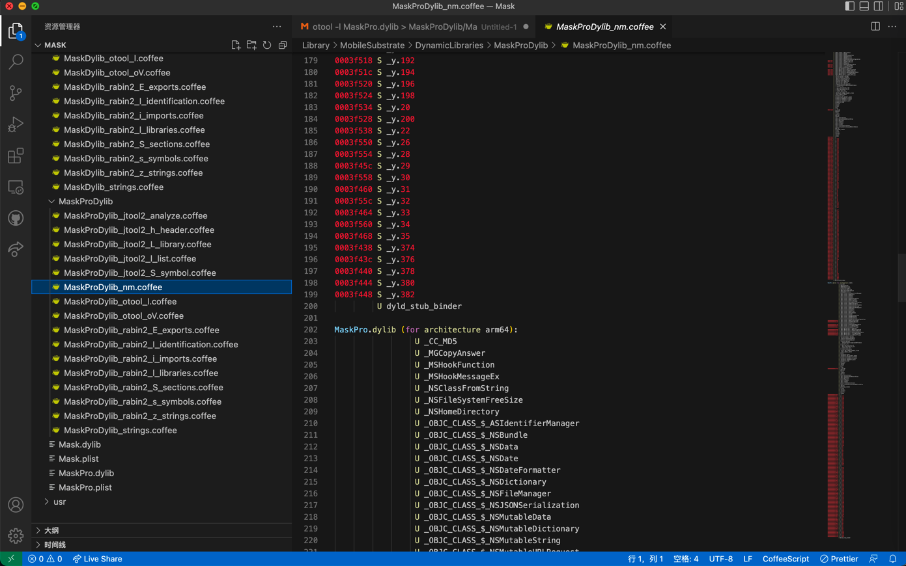

# 举例

## MaskPro.dylib

```bash
➜  DynamicLibraries nm MaskPro.dylib > MaskProDylib/MaskProDylib_nm.txt
```

输出：



```text
MaskPro.dylib (for architecture armv7):
         U _CC_MD5
         U _MGCopyAnswer
         U _MSHookFunction
         U _MSHookMessageEx
         U _NSClassFromString
         U _NSFileSystemFreeSize
         U _NSHomeDirectory
         U _OBJC_CLASS_$_ASIdentifierManager
         U _OBJC_CLASS_$_NSBundle
...
0003f440 S _y.378
0003f444 S _y.380
0003f448 S _y.382
         U dyld_stub_binder


MaskPro.dylib (for architecture arm64):
                 U _CC_MD5
                 U _MGCopyAnswer
                 U _MSHookFunction
                 U _MSHookMessageEx
                 U _NSClassFromString
                 U _NSFileSystemFreeSize
                 U _NSHomeDirectory
                 U _OBJC_CLASS_$_ASIdentifierManager
...
```
