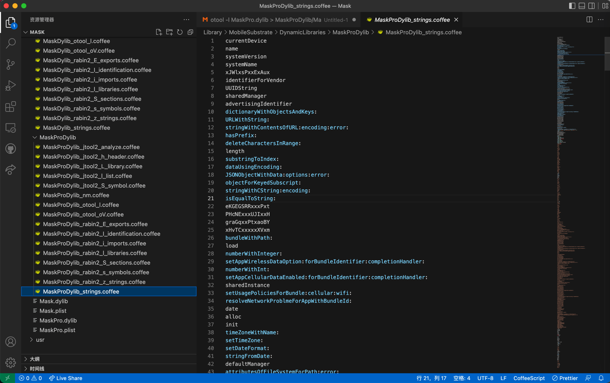
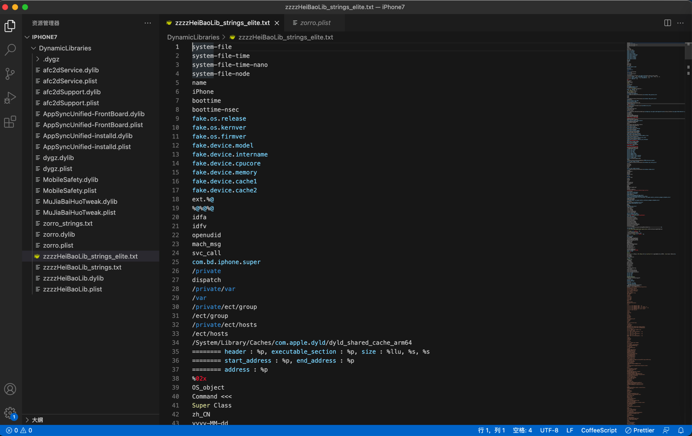
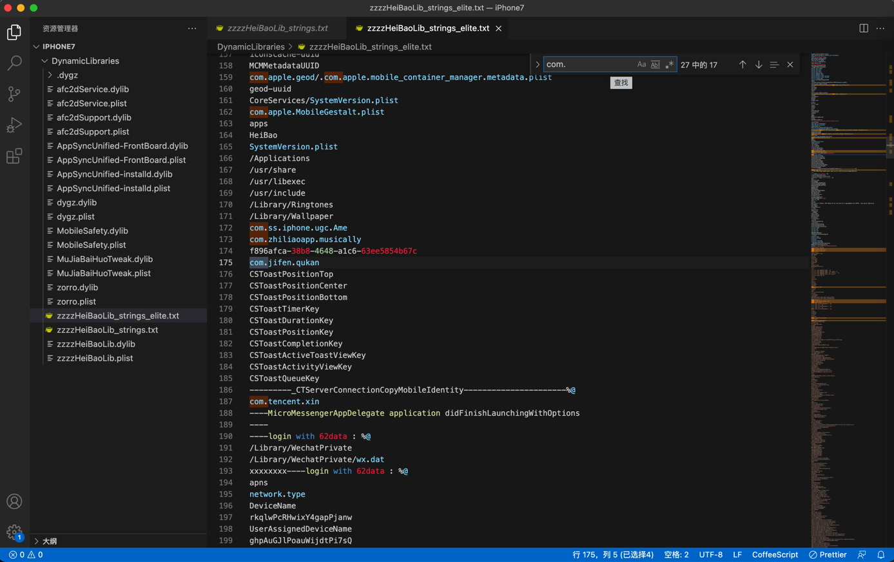
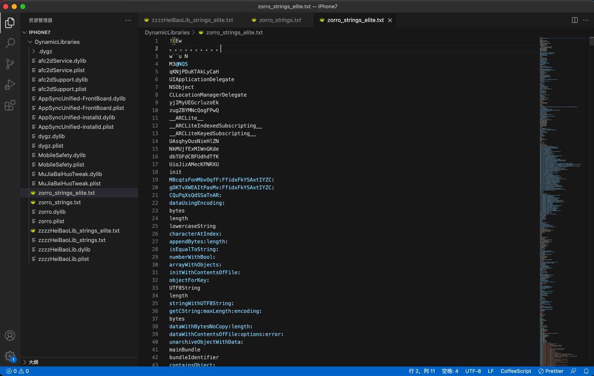

# strings用法举例

## MaskPro.dylib

```bash
➜  DynamicLibraries strings MaskPro.dylib > MaskProDylib/MaskProDylib_strings.txt
```

输出：



其中的：

```text
eKGEGSRRxxxPxt
PHcNExxxUJIxxH
graGqxxPtxaoBY
xHvTCxxxxxXVxm
```

很明显是：字符串加密的一种，手动替换或者hash成固定长度的字符串了。

## zzzzHeiBaoLib.dylib

```bash
➜  DynamicLibraries strings zzzzHeiBaoLib.dylib > zzzzHeiBaoLib_strings.txt
```

输出：`zzzzHeiBaoLib_strings.txt`

改名和提取核心字段后为：`zzzzHeiBaoLib_strings_elite.txt`





摘录部分内容：

* 疑似app
    * com.bd.iphone.super
    * com.apple.springboard
    * com.apple.geod/.com.apple.mobile_container_manager.metadata.plist
    * com.apple.MobileGestalt.plist
    * com.zhiliaoapp.musically
    * com.jifen.qukan
    * 趣头条
    * com.tencent.xin
    * com.kuaishou.nebula
    * 快手极速版
    * com.ss.iphone.ugc.Live
    * com.xunmeng.pinduoduo
    * com.soulapp.cn
    * 抖音
    * iPhone版
        * com.ss.iphone.ugc.Ame
        * com.ss.iphone.ugc.Aweme
        * com.ss.iphone.ugc.aweme.lite
    * 注：安卓版 是
        * com.ss.android.ugc.aweme
        * com.ss.android.ugc.aweme.lite
    * com.dragon.read
    * com.wemomo.momoappdemo1
    * com.jiangjia.gif
* 系统属性
    * carrier.name
    * carrier.mcc
    * carrier.mnc
    * carrier.icc
    * network.addr
    * network.dstaddr
    * location.latitude
    * location.longitude
    * identifierForVendor
    * systemVersion
    * operatingSystemVersionString
    * operatingSystemVersion
    * carrierName
    * mobileCountryCode
    * mobileNetworkCode
    * isoCountryCode
    * allowsVOIP
* 疑似越狱检测路径相关
  * /
    * /Applications
    * /usr
      * /usr/share
      * /usr/libexec
      * /usr/include
    * /ect/hosts
    * /private
      * /private/var
        * /private/var/containers/Bundle/Application/
      * /private/ect/group
    * /Library
      * /Library/Ringtones
      * /Library/Wallpaper
    * /System
      * /System/Library
        * /System/Library/Caches/com.apple.dyld/dyld_shared_cache_arm64
        * /System/Library/CoreServices/SystemVersion.plist
        * /System/Library/PreferenceBundles/VPNPreferences.bundle
    * /var
      * /var/containers/Shared/SystemGroup/systemgroup.com.apple.mobilegestaltcache/Library/Caches/com.apple.MobileGestalt.plist
* 黑豹本身有关
  * /var/mobile/Library/Preferences/com.heibao.fake_params.plist
  * /var/mobile/Library/Preferences/com.heibao.fake_prefs.plist
  * /var/mobile/Library/Preferences/com.heibao.vpn_config.plist
  * /var/mobile/Library/Preferences/com.heibao.scheme.plist
* 微信相关
  * /Library/WechatPrivate
  * /Library/WechatPrivate/wx.dat
* 反越狱检测相关
  * isJailbroken
  * btd_isJailBroken
  * isJailBreak
  * isJailBroken
  * HasInstallJailbreakPluginInvalidIAPPurchase
  * HasInstallJailbreakPlugin:
  * IsJailBreak
  * getJailbreakPath
  * getJailbreakRootDir
  * JailBroken
  * isDeviceJailBreak
  * isDeviceJailBroken
  * cannotPurchaseDuetoJailbreakPlugin:

## zorro.dylib

```bash
➜  DynamicLibraries strings zorro.dylib > zorro_strings.txt
```

输出：



结果分析：

* 反越狱检测的相关路径
  * /var/containers
  * /System/Library/Frameworks/
  * /var/containers/Bundle/Application/
  * /var/stash/
  * /private/var/db/stash/
  * /private/
  * /no/jailbreak
  * /System/Library/CoreServices/SystemVersion.plist
