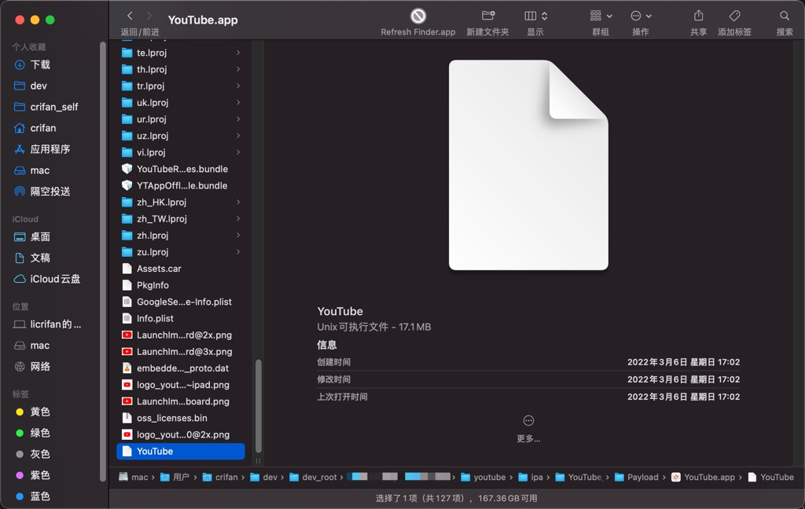
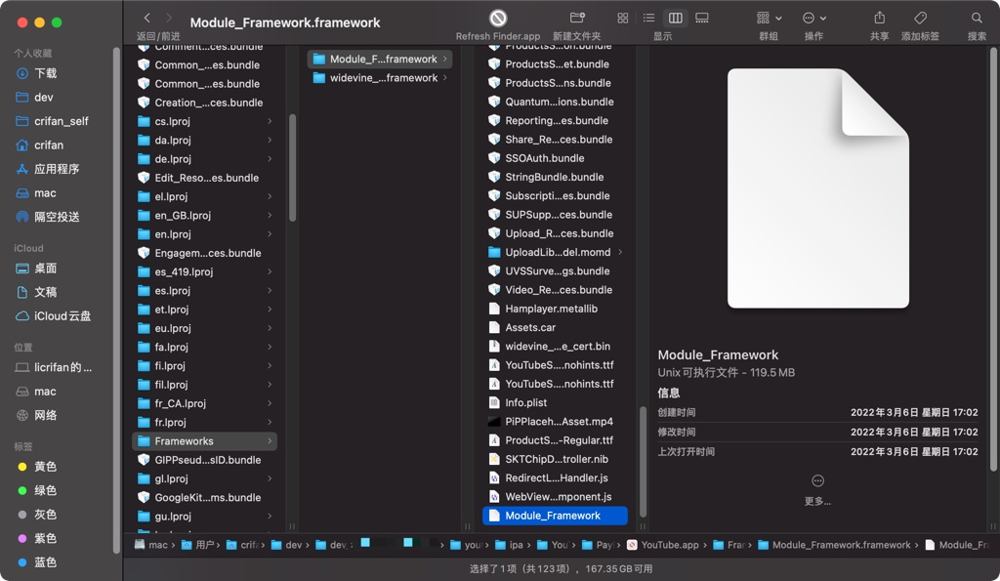
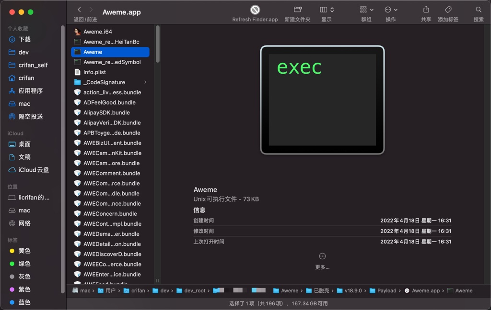
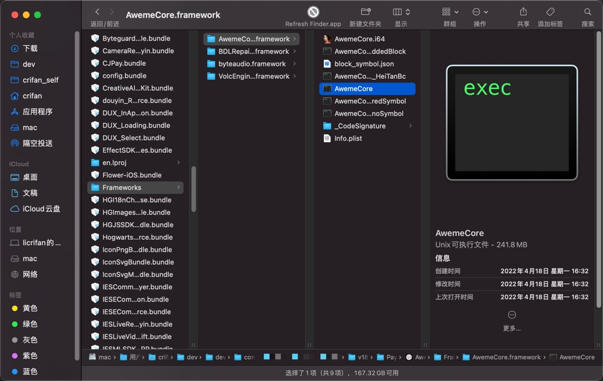

# 从ipa中找到二进制

TODO：

* 【未解决】静态分析抖音二进制寻找越狱检测手段
* 【已解决】如何从脱壳后的抖音的IPA文件中得到二进制文件

* 相关
  * 【已解决】越狱iPhone中抖音app的安装目录安装位置
  * 【已解决】研究iOS中app的目录的UUID类的值和app名称如何映射

---

作为iOS逆向的静态分析，其输入文件是iOS的app的二进制文件。

对应的就是，在前一步，[从app砸壳得到的ipa](https://book.crifan.org/books/ios_re_crack_shell_ipa/website/)文件中，找到对应的二进制文件，用于后续的静态分析。

比如：

* YouTube
  * v17.08.2
    * ipa解压后得到：`YouTube.app`
      * 入口二进制：`17MB+`的`YouTube`
        * 
      * 核心二进制：`100MB+`的`Frameworks/Module_Framework.framework/Module_Framework`
        * 
* 抖音
  * v18.9.0
    * ipa解压后得到：`Aweme.app`
      * 入口二进制：`70KB+`的`Aweme`
        * 
      * 核心二进制：`240MB+`的`Frameworks/AwemeCore.framework/AwemeCore`
        * 
