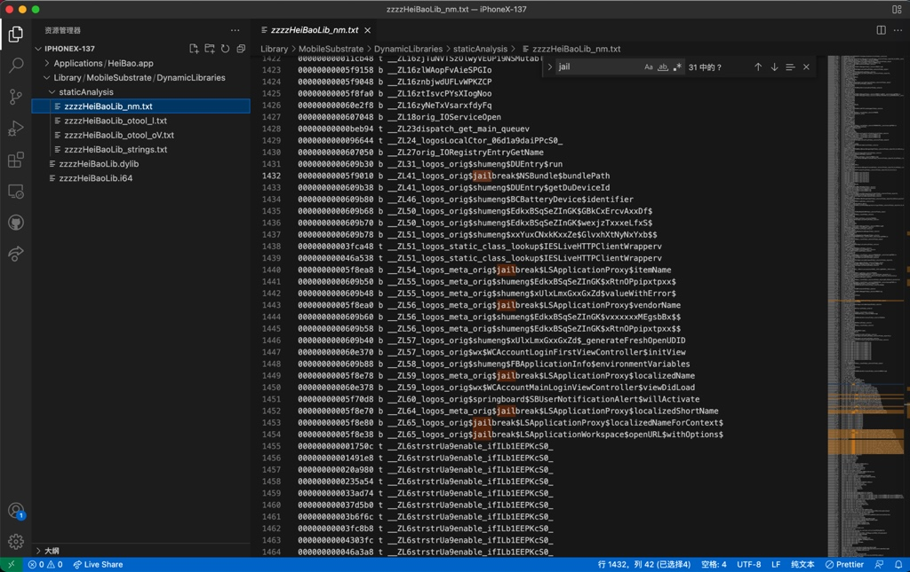

# 查看信息和导出字符串

TODO：

* 【记录】静态分析iOS的17.8.0旧版抖音
* 【记录】静态分析黑豹二进制HeiBao


---

此处对于静态分析中的，查看二进制信息和导出字符串等资源，给出实例，供参考。

## 通用成套做法

* 典型的**成套的做法** = `otool`+`nm`+`strings`+`jtool2`+`rabin2`：

```bash
otool -l iOSBinaryFile > iOSBinaryFile_otool_l.txt
otool -oV iOSBinaryFile > iOSBinaryFile_otool_oV.txt

nm iOSBinaryFile > iOSBinaryFile_nm.txt

strings iOSBinaryFile > iOSBinaryFile_strings.txt

jtool2 -h iOSBinaryFile > iOSBinaryFile_jtool2_h_header.txt
jtool2 -l iOSBinaryFile > iOSBinaryFile_jtool2_l_list.txt
jtool2 -L iOSBinaryFile > iOSBinaryFile_jtool2_L_library.txt
jtool2 -S iOSBinaryFile > iOSBinaryFile_jtool2_S_symbol.txt
jtool2 --analyze iOSBinaryFile > iOSBinaryFile_jtool2_analyze.txt
# mv iOSBinaryFile.ARM64.xxx-xxx-xxx-xxx-xxx iOSBinaryFile_jtool2_analyze.txt

rabin2 -I iOSBinaryFile > iOSBinaryFile_rabin2_I_identification.txt
rabin2 -i iOSBinaryFile > iOSBinaryFile_rabin2_i_imports.txt
rabin2 -E iOSBinaryFile > iOSBinaryFile_rabin2_E_exports.txt
rabin2 -l iOSBinaryFile > iOSBinaryFile_rabin2_l_libraries.txt
rabin2 -z iOSBinaryFile > iOSBinaryFile_rabin2_z_strings.txt
rabin2 -s iOSBinaryFile > iOSBinaryFile_rabin2_s_symbols.txt
rabin2 -S iOSBinaryFile > iOSBinaryFile_rabin2_S_sections.txt
```

* 特殊：
  * 如果二进制是`FAT`格式=`胖二进制`，那么对于`jtool2`，要指定架构才能继续
    ```bash
    export ARCH=arm64
    jtool2 -h iOSBinaryFile > iOSBinaryFile_jtool2_h_header.txt
    ```

## 举例

### HeiBao的dylib

对于二级制文件，此处是dylib的动态库：

```bash
➜  DynamicLibraries pwd
/Users/crifan/dev/DevRoot/Aweme/exportFromiPhone/iPhoneX-137/Library/MobileSubstrate/DynamicLibraries
➜  DynamicLibraries ll
total 152568
-rwxr-xr-x@ 1 crifan  staff   6.2M  3 14 10:34 zzzzHeiBaoLib.dylib
-rw-r--r--  1 crifan  staff    68M  3 17 21:39 zzzzHeiBaoLib.i64
```

去导出字符串等资源：

```bash
➜  DynamicLibraries otool -l zzzzHeiBaoLib.dylib > HeiBaoLib_otool_l.txt
➜  DynamicLibraries otool -oV zzzzHeiBaoLib.dylib > HeiBaoLib_otool_oV.txt
➜  DynamicLibraries nm zzzzHeiBaoLib.dylib > HeiBaoLib_nm.txt
➜  DynamicLibraries strings zzzzHeiBaoLib.dylib > HeiBaoLib_strings.txt

➜  DynamicLibraries ll
total 153112
-rw-r--r--  1 crifan  staff   108K  3 21 10:00 HeiBaoLib_nm.txt
-rw-r--r--  1 crifan  staff    12K  3 21 10:00 HeiBaoLib_otool_l.txt
-rw-r--r--  1 crifan  staff    51K  3 21 10:00 HeiBaoLib_otool_oV.txt
-rw-r--r--  1 crifan  staff    89K  3 21 10:00 HeiBaoLib_strings.txt
-rwxr-xr-x@ 1 crifan  staff   6.2M  3 14 10:34 zzzzHeiBaoLib.dylib
-rw-r--r--  1 crifan  staff    68M  3 17 21:39 zzzzHeiBaoLib.i64
```

后续即可去分析和搜索想要研究的值了。

比如：

搜索越狱 jailbreak 相关内容：



### 抖音的AwemeCore

```bash
jtool2 -h ../../../../已脱壳/v18.9.0/Payload/Aweme.app/Frameworks/AwemeCore.framework/AwemeCore

jtool2 -l ../../../../已脱壳/v18.9.0/Payload/Aweme.app/Frameworks/AwemeCore.framework/AwemeCore > AwemeCore_jtool2_l_list.txt
jtool2 -L ../../../../已脱壳/v18.9.0/Payload/Aweme.app/Frameworks/AwemeCore.framework/AwemeCore > AwemeCore_jtool2_L_library.txt

jtool2 -S ../../../../已脱壳/v18.9.0/Payload/Aweme.app/Frameworks/AwemeCore.framework/AwemeCore > AwemeCore_jtool2_S.txt

jtool2 --analyze ../../../../已脱壳/v18.9.0/Payload/Aweme.app/Frameworks/AwemeCore.framework/AwemeCore > AwemeCore_jtool2_analyze.txt


rabin2 -I ../../../../已脱壳/v18.9.0/Payload/Aweme.app/Frameworks/AwemeCore.framework/AwemeCore

rabin2 -i ../../../../已脱壳/v18.9.0/Payload/Aweme.app/Frameworks/AwemeCore.framework/AwemeCore > AwemeCore_rabin2_i.txt

rabin2 -E ../../../../已脱壳/v18.9.0/Payload/Aweme.app/Frameworks/AwemeCore.framework/AwemeCore > AwemeCore_rabin2_E.txt

rabin2 -l ../../../../已脱壳/v18.9.0/Payload/Aweme.app/Frameworks/AwemeCore.framework/AwemeCore > AwemeCore_rabin2_l.txt

rabin2 -z ../../../../已脱壳/v18.9.0/Payload/Aweme.app/Frameworks/AwemeCore.framework/AwemeCore > AwemeCore_rabin2_z.txt

rabin2 -s ../../../../已脱壳/v18.9.0/Payload/Aweme.app/Frameworks/AwemeCore.framework/AwemeCore > AwemeCore_rabin2_s.txt

rabin2 -S ../../../../已脱壳/v18.9.0/Payload/Aweme.app/Frameworks/AwemeCore.framework/AwemeCore > AwemeCore_rabin2_S_section.txt
```

### MaskPro.dylib

```bash
➜  DynamicLibraries otool -l MaskPro.dylib > MaskProDylib/MaskProDylib_otool_l.txt
➜  DynamicLibraries otool -oV MaskPro.dylib > MaskProDylib/MaskProDylib_otool_oV.txt
➜  DynamicLibraries nm MaskPro.dylib > MaskProDylib/MaskProDylib_nm.txt
➜  DynamicLibraries strings MaskPro.dylib > MaskProDylib/MaskProDylib_strings.txt
```

期间遇到`FAT`=`胖二进制`的问题：

```bash
➜  DynamicLibraries jtool2 -h MaskPro.dylib > MaskProDylib/MaskProDylib_jtool2_h_header.txt
Fat binary, little-endian, 2 architectures: armv7, arm64
Select an architecture setting the ARCH= environment variable
```

解决办法：

```bash
➜  DynamicLibraries export ARCH=arm64
➜  DynamicLibraries jtool2 -h MaskPro.dylib > MaskProDylib/MaskProDylib_jtool2_h_header.txt
```

继续：

```bash
➜  DynamicLibraries jtool2 -l MaskPro.dylib > MaskProDylib/MaskProDylib_jtool2_l_list.txt
➜  DynamicLibraries jtool2 -L MaskPro.dylib > MaskProDylib/MaskProDylib_jtool2_L_library.txt
➜  DynamicLibraries jtool2 -S MaskPro.dylib > MaskProDylib/MaskProDylib_jtool2_S_symbol.txt
➜  DynamicLibraries jtool2 --analyze MaskPro.dylib > MaskProDylib/MaskProDylib_jtool2_analyze.txt
...
```

继续：

```bash
➜  DynamicLibraries rabin2 -I MaskPro.dylib > MaskProDylib/MaskProDylib_rabin2_I_identification.txt
➜  DynamicLibraries rabin2 -i MaskPro.dylib > MaskProDylib/MaskProDylib_rabin2_i_imports.txt
➜  DynamicLibraries rabin2 -E MaskPro.dylib > MaskProDylib/MaskProDylib_rabin2_E_exports.txt
➜  DynamicLibraries rabin2 -l MaskPro.dylib > MaskProDylib/MaskProDylib_rabin2_l_libraries.txt
➜  DynamicLibraries rabin2 -z MaskPro.dylib > MaskProDylib/MaskProDylib_rabin2_z_strings.txt
➜  DynamicLibraries rabin2 -s MaskPro.dylib > MaskProDylib/MaskProDylib_rabin2_s_symbols.txt
➜  DynamicLibraries rabin2 -S MaskPro.dylib > MaskProDylib/MaskProDylib_rabin2_S_sections.txt
```

### Mask的dylib

对于一个二进制，此处是一个动态库文件`Mask.dylib`，想要导出字符串等资源，供后续分析。

* 典型的**成套的做法** = `otool`+`nm`+`strings`+`jtool2`+`rabin2`：

```bash
otool -l Mask.dylib > MaskDylib_otool_l.txt
otool -oV Mask.dylib > MaskDylib_otool_oV.txt

nm Mask.dylib > MaskDylib_nm.txt

strings Mask.dylib > MaskDylib_strings.txt

jtool2 -h Mask.dylib > MaskDylib_jtool2_h_header.txt
jtool2 -l Mask.dylib > MaskDylib_jtool2_l_list.txt
jtool2 -L Mask.dylib > MaskDylib_jtool2_L_library.txt
jtool2 -S Mask.dylib > MaskDylib_jtool2_S_symbol.txt
jtool2 --analyze Mask.dylib > MaskDylib_jtool2_analyze.txt

rabin2 -I Mask.dylib > MaskDylib_rabin2_I_identification.txt
rabin2 -i Mask.dylib > MaskDylib_rabin2_i_imports.txt
rabin2 -E Mask.dylib > MaskDylib_rabin2_E_exports.txt
rabin2 -l Mask.dylib > MaskDylib_rabin2_l_libraries.txt
rabin2 -z Mask.dylib > MaskDylib_rabin2_z_strings.txt
rabin2 -s Mask.dylib > MaskDylib_rabin2_s_symbols.txt
rabin2 -S Mask.dylib > MaskDylib_rabin2_S_sections.txt
```
