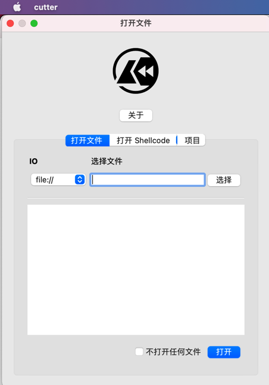
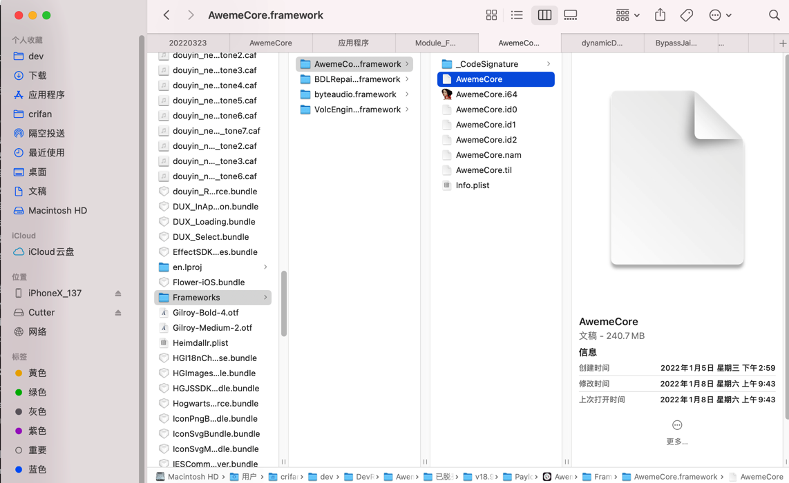
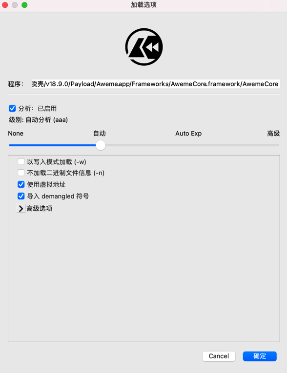
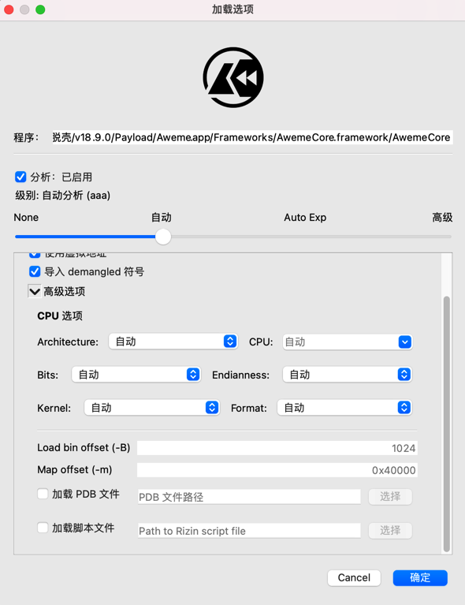
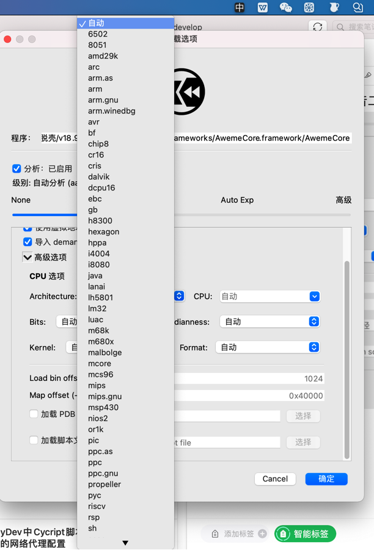
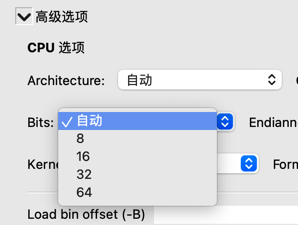
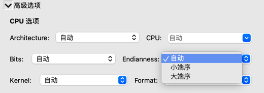
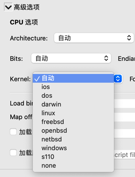
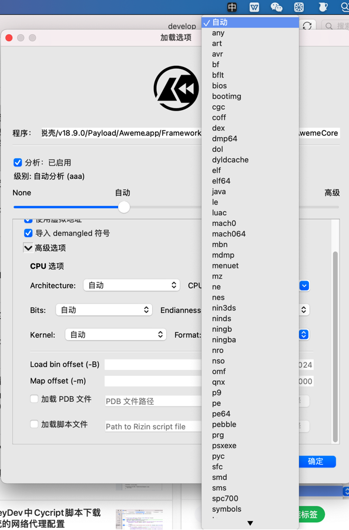
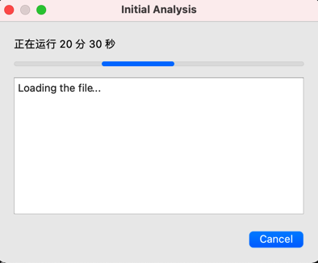

# Cutter使用举例：AwemeCore

打开页面：

把要逆向的文件`AwemeCore`拖动过去：

加载选项：

点击展开`高级选项`看看：

各个参数选项：

* `architecture`：支持很多类型
  * 
* bits
  * 
* Endianness
  * 
* kernel
  * 
* format
  * 

开始加载和分析：

运行了几个小时，都没结束。效率太低。那算了，最终放弃。
