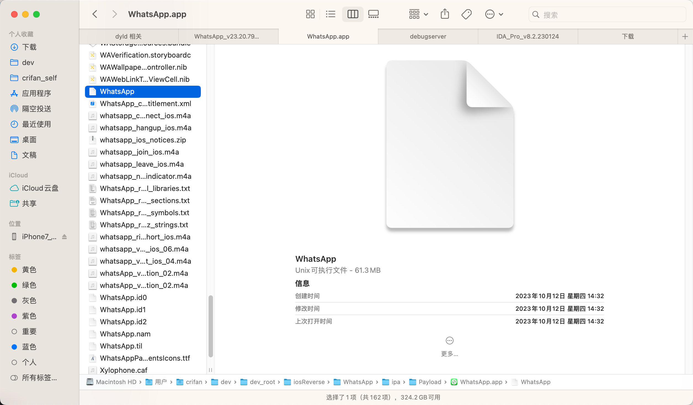
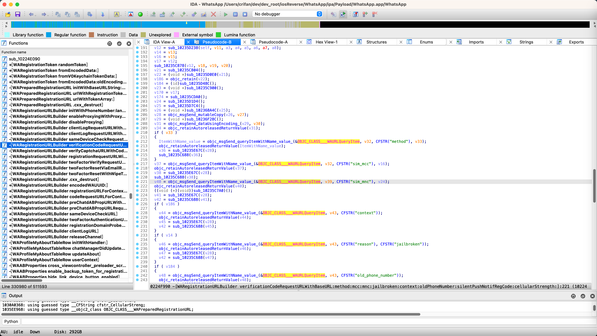
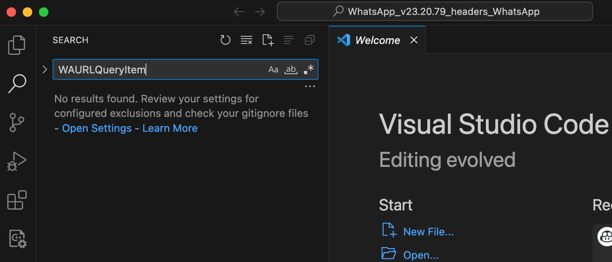
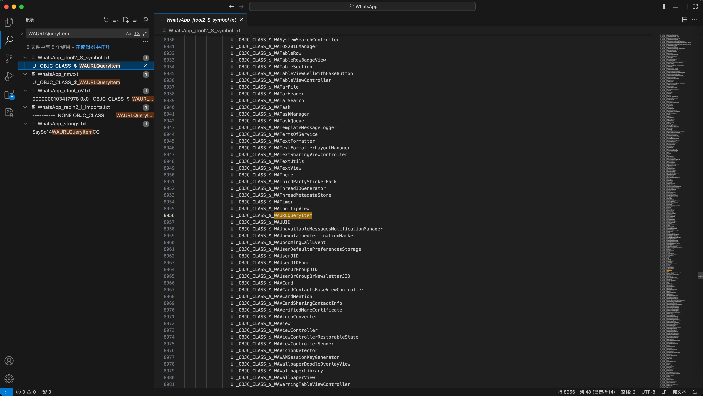
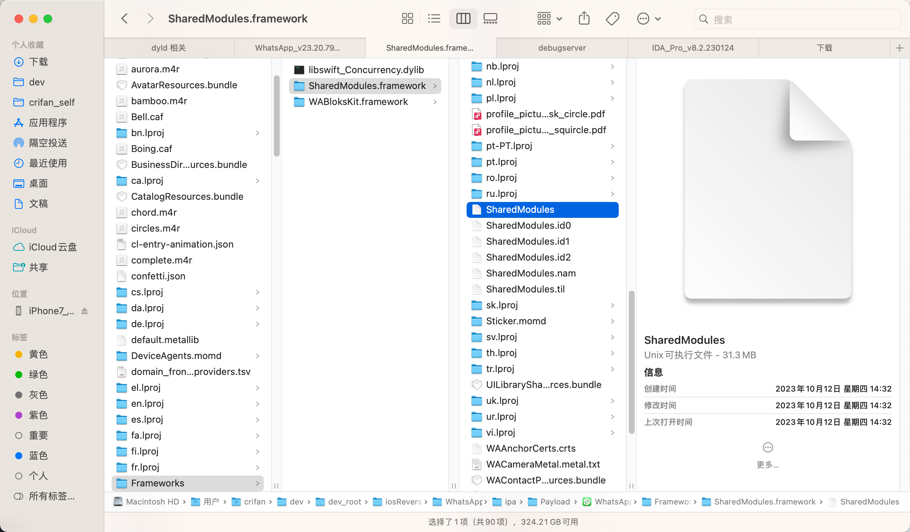
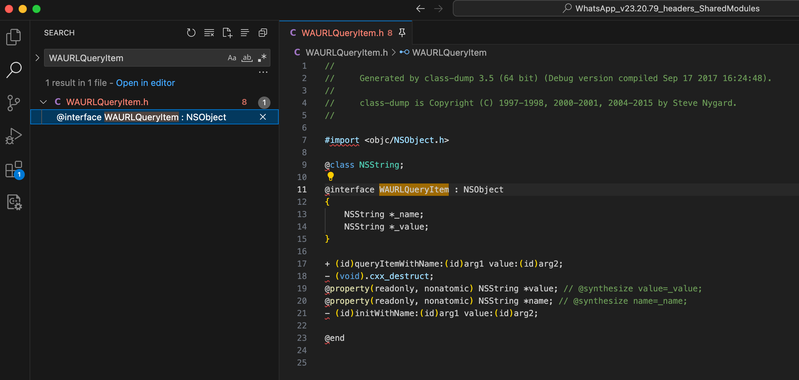
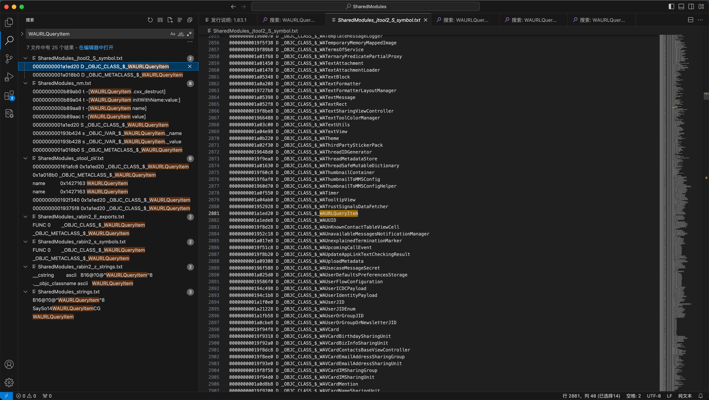
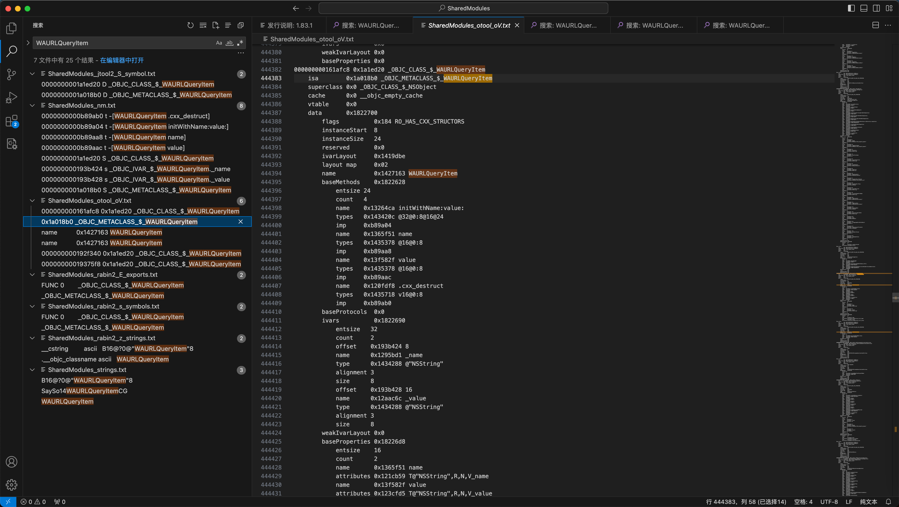

# 静态分析心得

此处整理iOS逆向期间的静态分析反面的心得。

## 当前二进制找不到函数时，找别的二进制看看

概述：

* iOS逆向期间，如果当前二进制中找不到某个类和函数时，可以去试试：找其他二进制
  * 以及可以从加载动态库依赖中，确认是否是依赖于别的二进制
  * 以及二进制查看函数
    * 一个是U=Undefined：是当前二进制未定义的，需要从别的二进制导入的
    * 一个是 D=Defined：是当前二进制实现的类和函数

### WhatsApp找不到WAURLQueryItem，但别的二进制SharedModules中可以找到

iOS的app`WhatsApp`中的主要二进制是：

* `WhatsApp`
  * 

去逆向期间，发现`IDA`伪代码中：



```c
id __cdecl -[WARegistrationURLBuilder verificationCodeRequestURLWithBaseURL:method:mcc:mnc:jailbroken:context:oldPhoneNumber:silentPushNotifRegCode:cellularStrength:](
        WARegistrationURLBuilder *self,
        SEL a2,
        id a3,
        id a4,
        id a5,
        id a6,
        bool a7,
        id a8,
        id a9,
        id a10,
        id a11)
{
...
    v46 = objc_msgSend_queryItemWithName_value_(&OBJC_CLASS___WAURLQueryItem, v43, CFSTR("reason"), CFSTR("jailbroken"));
```

其中有：

* `OBJC_CLASS___WAURLQueryItem`
  * iOS的类：`WAURLQueryItem`

但是，此处WhatsApp的主要二进制`WhatsApp`中，竟然找不到`WAURLQueryItem`

具体现象是：

* WhatsApp
  * 导出的的头文件中
    * 搜不到：`WAURLQueryItem`
      * 
  * 后来在导出的字符串等资源中
    * 能搜到`WAURLQueryItem`的字眼
      * 
    * 搜索到的内容有
      ```bash
      WhatsApp_jtool2_S_symbol.txt:
        8954                   U _OBJC_CLASS_$_WATooltipView
        8955                   U _OBJC_CLASS_$_WATooltipView
        8956:                  U _OBJC_CLASS_$_WAURLQueryItem
        8956                   U _OBJC_CLASS_$_WAUUID
        8957                   U _OBJC_CLASS_$_WAUUID

      WhatsApp_nm.txt:
        8954                   U _OBJC_CLASS_$_WATooltipView
        8955:                  U _OBJC_CLASS_$_WAURLQueryItem
        8956                   U _OBJC_CLASS_$_WAUUID

      WhatsApp_otool_oV.txt:
        1050534  0000000103417970 0x0 _OBJC_CLASS_$_NSURLComponents
        1050535: 0000000103417978 0x0 _OBJC_CLASS_$_WAURLQueryItem
        1050536  0000000103417980 0x0 _OBJC_CLASS_$_WACacheQueue

      WhatsApp_rabin2_i_imports.txt:
        8957  8953  ----------  NONE OBJC_CLASS         WATooltipView
        8958: 8954  ----------  NONE OBJC_CLASS         WAURLQueryItem
        8959  8955  ----------  NONE OBJC_CLASS         WAUUID
      ```
      * 具体分析：
        * `WhatsApp_jtool2_S_symbol.txt`中的
          * `8956:                  U _OBJC_CLASS_$_WAURLQueryItem`
            * 相关含义：U=Undefined=未定义
        * `WhatsApp_rabin2_i_imports.txt`中的
          * `8958: 8954  ----------  NONE OBJC_CLASS         WAURLQueryItem`
            * 中有WAURLQueryItem：表示WAURLQueryItem是属于（从外部）import进来的
      * -> 表示此类：WAURLQueryItem，是从外部导入import进来的，当前二进制（WhatsApp）中是没有此类的具体实现的

最后是从同一个iOSapp：`WhatsApp`的：

* 另外一个核心二进制`SharedModules`
  * 

中找到了：类`WAURLQueryItem`的具体实现

具体现象是：

* SharedModules的导出头文件中，能搜到：类WAURLQueryItem
  * 
* 以及SharedModules导出的字符串资源中，也能找到：类WAURLQueryItem





```bash
25 个结果 - 7 文件

SharedModules_jtool2_S_symbol.txt:
  2880  0000000001952928 D _OBJC_CLASS_$_WATrustSignalsDataFetcher
  2881: 0000000001a1ed20 D _OBJC_CLASS_$_WAURLQueryItem
  2882  0000000001a1ede8 D _OBJC_CLASS_$_WAUUID

  6993  0000000001a26170 D _OBJC_METACLASS_$_WATrustSignalsDataFetcher
  6994: 0000000001a018b0 D _OBJC_METACLASS_$_WAURLQueryItem
  6995  0000000001a1ecf8 D _OBJC_METACLASS_$_WAUUID

SharedModules_nm.txt:
   25025  00000000000ac75c t -[WATrustSignalsDataFetcher init]
   25026: 0000000000b89ab0 t -[WAURLQueryItem .cxx_destruct]
   25027: 0000000000b89a04 t -[WAURLQueryItem initWithName:value:]
   25028: 0000000000b89aa8 t -[WAURLQueryItem name]
   25029: 0000000000b89aac t -[WAURLQueryItem value]
   25030  0000000000ee293c t -[WAUUID .cxx_destruct]

   92477  0000000001952928 S _OBJC_CLASS_$_WATrustSignalsDataFetcher
   92478: 0000000001a1ed20 S _OBJC_CLASS_$_WAURLQueryItem
   92479  0000000001a1ede8 S _OBJC_CLASS_$_WAUUID

  101272  0000000001a261b8 d _OBJC_IVAR_$_WATrustSignalsDataFetcher.workQueue
  101273: 000000000193b424 s _OBJC_IVAR_$_WAURLQueryItem._name
  101274: 000000000193b428 s _OBJC_IVAR_$_WAURLQueryItem._value
  101275  000000000193dc64 s _OBJC_IVAR_$_WAUUID._creationDate

  112634  0000000001a26170 D _OBJC_METACLASS_$_WATrustSignalsDataFetcher
  112635: 0000000001a018b0 S _OBJC_METACLASS_$_WAURLQueryItem
  112636  0000000001a1ecf8 S _OBJC_METACLASS_$_WAUUID

SharedModules_otool_oV.txt:
  444381          baseProperties 0x0
  444382: 000000000161afc8 0x1a1ed20 _OBJC_CLASS_$_WAURLQueryItem
  444383:     isa        0x1a018b0 _OBJC_METACLASS_$_WAURLQueryItem
  444384      superclass 0x0 _OBJC_CLASS_$_NSObject

  444393          layout map     0x02 
  444394:         name           0x1427163 WAURLQueryItem
  444395          baseMethods    0x1822628

  444442          ivarLayout     0x0
  444443:         name           0x1427163 WAURLQueryItem
  444444          baseMethods    0x18225c0

  672642  000000000192f338 0x1a02120 _OBJC_CLASS_$_WAStashedMessage
  672643: 000000000192f340 0x1a1ed20 _OBJC_CLASS_$_WAURLQueryItem
  672644  000000000192f348 0x1a16aa8 _OBJC_CLASS_$_WAPBPeerMessage

  676826  00000000019375f0 0x1a01ba8 _OBJC_CLASS_$_WALogWriter
  676827: 00000000019375f8 0x1a1ed20 _OBJC_CLASS_$_WAURLQueryItem
  676828  0000000001937600 0x1a01928 _OBJC_CLASS_$_WAFuture

SharedModules_rabin2_E_exports.txt:
  34621  34617 0x01952928 0x01952928 GLOBAL FUNC 0        _OBJC_CLASS_$_WATrustSignalsDataFetcher
  34622: 34618 0x01a1ed20 0x01a1ed20 GLOBAL FUNC 0        _OBJC_CLASS_$_WAURLQueryItem
  34623  34619 0x01a1ede8 0x01a1ede8 GLOBAL FUNC 0        _OBJC_CLASS_$_WAUUID

  38734  38730 0x01a26170 0x01a26170 GLOBAL FUNC 0        _OBJC_METACLASS_$_WATrustSignalsDataFetcher
  38735: 38731 0x01a018b0 0x01a018b0 GLOBAL FUNC 0        _OBJC_METACLASS_$_WAURLQueryItem
  38736  38732 0x01a1ecf8 0x01a1ecf8 GLOBAL FUNC 0        _OBJC_METACLASS_$_WAUUID

SharedModules_rabin2_s_symbols.txt:
  34621  34617 0x01952928 0x01952928 GLOBAL FUNC 0        _OBJC_CLASS_$_WATrustSignalsDataFetcher
  34622: 34618 0x01a1ed20 0x01a1ed20 GLOBAL FUNC 0        _OBJC_CLASS_$_WAURLQueryItem
  34623  34619 0x01a1ede8 0x01a1ede8 GLOBAL FUNC 0        _OBJC_CLASS_$_WAUUID

  38734  38730 0x01a26170 0x01a26170 GLOBAL FUNC 0        _OBJC_METACLASS_$_WATrustSignalsDataFetcher
  38735: 38731 0x01a018b0 0x01a018b0 GLOBAL FUNC 0        _OBJC_METACLASS_$_WAURLQueryItem
  38736  38732 0x01a1ecf8 0x01a1ecf8 GLOBAL FUNC 0        _OBJC_METACLASS_$_WAUUID

SharedModules_rabin2_z_strings.txt:
   18365  13101 0x0114de06 0x0114de06 34   35   5.__TEXT.__cstring         ascii   mms-base-task//finish/finishing/%@
   18366  13101 0x0114de06 0x0114de06 34   35   5.__TEXT.__cstring         ascii   mms-base-task//finish/finishing/%@
   18367: 13102 0x0114de29 0x0114de29 24   25   5.__TEXT.__cstring         ascii   B16@?0@"WAURLQueryItem"8

   18367  13103 0x0114de42 0x0114de42 7    8    5.__TEXT.__cstring         ascii   _nc_cat
   18368  13103 0x0114de42 0x0114de42 7    8    5.__TEXT.__cstring         ascii   _nc_cat

  114694  2073  0x0142715e 0x0142715e 4    5    12.__TEXT.__objc_classname ascii   HTML
  114695  2073  0x0142715e 0x0142715e 4    5    12.__TEXT.__objc_classname ascii   HTML
  114696: 2074  0x01427163 0x01427163 14   15   12.__TEXT.__objc_classname ascii   WAURLQueryItem
  114696  2075  0x01427172 0x01427172 13   14   12.__TEXT.__objc_classname ascii   DataDetection
  114697  2075  0x01427172 0x01427172 13   14   12.__TEXT.__objc_classname ascii   DataDetection

SharedModules_strings.txt:
   17521  mms-base-task//finish/finishing/%@
   17522: B16@?0@"WAURLQueryItem"8
   17523  _nc_cat

  112316  ySo11WAMessageIDCSo0A0C_G
  112317: SaySo14WAURLQueryItemCG
  112318  SDySo11WADeviceJIDC

  114720  HTML
  114721: WAURLQueryItem
  114722  DataDetection
```

具体解释是：


* `SharedModules_jtool2_S_symbol.txt`
  * 中的
    * `2881: 0000000001a1ed20 D _OBJC_CLASS_$_WAURLQueryItem`
    * `6994: 0000000001a018b0 D _OBJC_METACLASS_$_WAURLQueryItem`
  * 其中：
    * **D**=`Defined`=`已定义`=`有定义`
    * `_OBJC_CLASS_` = 是ObjC的class类
    * `_OBJC_METACLASS_` = 是ObjC的meta class=元类
* `SharedModules_nm.txt`
  * `25027: 0000000000b89a04 t -[WAURLQueryItem initWithName:value:]`
    * **t**=`Text symbol, local (static)` = 本地的static的文本符号
      * 函数名： -[WAURLQueryItem initWithName:value:]
  * `92478: 0000000001a1ed20 S _OBJC_CLASS_$_WAURLQueryItem`
    * **S**=`Section symbol, global` = 全局的节的符号，此处ObjC的类WAURLQueryItem
  * `101273: 000000000193b424 s _OBJC_IVAR_$_WAURLQueryItem._name`
    * **t**=`Text symbol, local (static)` = 本地的static的文本符号
      * ObjC类WAURLQueryItem的ivar变量名_name
  * `112635: 0000000001a018b0 S _OBJC_METACLASS_$_WAURLQueryItem`
    * **S**=`Section symbol, global` = 全局的节的符号，此处是ObjC的MetaClass元类WAURLQueryItem
* `SharedModules_otool_oV.txt`
  * `444382: 000000000161afc8 0x1a1ed20 _OBJC_CLASS_$_WAURLQueryItem`
    * 是有ObjC的类：WAURLQueryItem
* `SharedModules_rabin2_E_exports.txt`
  * 中的
    * `34622: 34618 0x01a1ed20 0x01a1ed20 GLOBAL FUNC 0    _OBJC_CLASS_$_WAURLQueryItem`
    * `38735: 38731 0x01a018b0 0x01a018b0 GLOBAL FUNC 0    _OBJC_METACLASS_$_WAURLQueryItem`
  * 表示：
    * 有ObjC的普通类WAURLQueryItem 和ObjC的元类WAURLQueryItem，要导出export （供别处调用）
* `SharedModules_rabin2_s_symbols.txt`
  * 中的
    * `34622: 34618 0x01a1ed20 0x01a1ed20 GLOBAL FUNC 0    _OBJC_CLASS_$_WAURLQueryItem`
    * `38735: 38731 0x01a018b0 0x01a018b0 GLOBAL FUNC 0    _OBJC_METACLASS_$_WAURLQueryItem`
  * 表示
    * 有global全局的类：ObjC普通类和元类：WAURLQueryItem的 s=symbol符号
* `SharedModules_rabin2_z_strings.txt`
  * `114696: 2074 0x01427163 0x01427163 14  15  12.__TEXT.__objc_classname ascii  WAURLQueryItem`
    * 表示：WAURLQueryItem是个Text节（Section）的ObjC的类名`__objc_classname`
* `SharedModules_strings.txt`
  * 中的
    * `17522: B16@?0@"WAURLQueryItem"8`
    * `112317: SaySo14WAURLQueryItemCG`
    * `114721: WAURLQueryItem`
  * 表示
    * 有类WAURLQueryItem相关的字符串（类名）和函数名等内容
